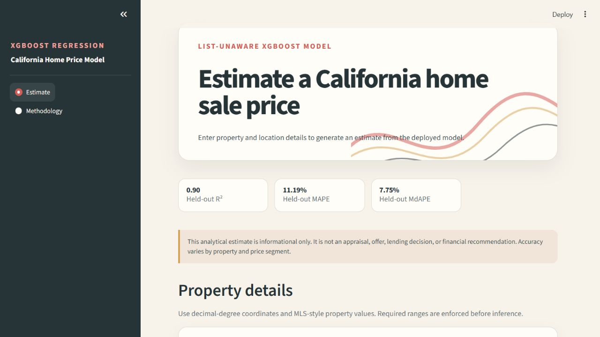

# California Home Price Prediction

An end-to-end machine learning project that predicts sale prices for California single-family residences without using list price. The repository includes the exploratory analysis, preprocessing and model-building notebooks, a verified XGBoost artifact, focused tests, and a deployable Streamlit application.

**Live application:** [xgb-cali-houseprices.streamlit.app](https://xgb-cali-houseprices.streamlit.app/)

The primary model achieved **0.90 R²**, **11.19% MAPE**, and **7.75% MdAPE** on a later-time September-October 2025 holdout. The final training frame contained **78,162 records** and **12 property features**.

## Project scope

This work was completed during a remote Data Science Internship at IDXExchange from September 9 through December 9, 2025. The five-person team generally developed models individually and reviewed progress in weekly meetings.

Marko Miovski's contribution covered California housing-data analysis, preprocessing, feature engineering, XGBoost modeling, validation, evaluation, model comparison, and the Streamlit application. The application serves the list-unaware XGBoost model developed in this work. IDXExchange's later website integration was performed by others.

## Why list-unaware

The deployed model excludes `ListPrice` and `OriginalListPrice`. Those fields closely track final sale price but are unavailable for homes that are not actively listed. Removing them creates a harder and more useful task: estimating a sale price from property and location characteristics alone.

A list-aware benchmark in the modeling notebook quantifies the predictive advantage of listing-price fields. It is not used by the deployed application.

## Results

| Model | Held-out R² | MAPE | MdAPE | Role |
| --- | ---: | ---: | ---: | --- |
| List-unaware XGBoost | 0.90 | 11.19% | 7.75% | Primary deployed model |
| List-aware XGBoost | 0.99 | 3.30% | 2.10% | Listing-price benchmark |

Training uses January through August 2025. September and October 2025 are held out as a later-time evaluation period. The metrics above were reproduced by the executed modeling notebook on CPU using the pinned environment. Software tests verify application behavior and do not constitute a second performance evaluation.

The list-unaware model's error varies across price segments:

| Held-out sale-price band | MAPE | MdAPE |
| --- | ---: | ---: |
| Below $500K | 12.96% | 7.40% |
| $500K to $1M | 9.64% | 6.54% |
| $1M to $2M | 11.85% | 9.07% |
| $2M to $5M | 13.89% | 11.52% |

These band results come from the executed modeling notebook. No held-out homes remained above $5 million after the documented training-derived filters.

## Modeling pipeline

1. Load January through October 2025 monthly sales records.
2. Use January-August for training and September-October for held-out evaluation.
3. Filter to California single-family sales, resolve duplicate listings, and apply property-value checks.
4. Impute from observed training values and learn percentile bounds without using held-out data.
5. Train list-aware and list-unaware XGBoost regressors on `ln(ClosePrice)`, then evaluate dollar predictions after applying `exp`.
6. Package the list-unaware booster in native XGBoost UBJSON format for inference.

The complete analysis is in [notebooks/eda.ipynb](notebooks/eda.ipynb) and [notebooks/modeling.ipynb](notebooks/modeling.ipynb). Both notebooks were executed from start to finish with zero retained errors.

## Model contract

The 12 inputs cover location, listing duration, living and lot area, bedrooms, bathrooms, construction year, parking, stories, fireplace, and pool status. Runtime validation rejects missing, non-finite, type-invalid, out-of-range, and internally inconsistent values. Exact column names, order, encodings, and integrity checks are documented in [MODEL_CARD.md](MODEL_CARD.md).

## Application

The Streamlit application provides:

- A validated estimation form and formatted sale-price output
- Aggregate metrics, chronological evaluation details, and price-band errors
- XGBoost gain importance with on-demand global and local SHAP explanations
- Responsive layouts with clear usage limitations

SHAP contributions are calculated on demand through XGBoost's native TreeSHAP mode. If explanations are unavailable, core price inference remains usable.



## Run locally

Use Python 3.12.

```powershell
python -m venv .venv
.\.venv\Scripts\Activate.ps1
python -m pip install -r requirements.txt
python -m streamlit run app.py
```

Open `http://localhost:8501`.

To run the tests:

```powershell
python -m pip install -r requirements-dev.txt
python -m pytest -q
```

## Deploy on Streamlit Community Cloud

The live application runs on Python 3.12 with no secrets or external services. Streamlit Community Cloud tracks `main`, launches root-level `app.py`, and installs the smaller CPU-only XGBoost wheel from `requirements.txt`. See [docs/DEPLOYMENT.md](docs/DEPLOYMENT.md) for operational details and verification checks.

## Repository structure

```text
.
|-- app.py                         Streamlit entrypoint
|-- artifacts/
|   |-- model_metadata.json        Model contract, metrics, and checksums
|   |-- shap_background.csv        Feature-only explanation sample
|   `-- xgb_nolist.ubj             Native XGBoost model
|-- docs/
|   `-- DEPLOYMENT.md              Streamlit Cloud deployment runbook
|-- housing_price/
|   |-- charts.py                  Accessible model charts
|   |-- contract.py                Feature schema and validation
|   |-- explanations.py            Optional SHAP and gain helpers
|   |-- inference.py               Artifact verification and inference
|   `-- styles.py                  Streamlit visual system
|-- notebooks/
|   |-- eda.ipynb                  Executed EDA and preprocessing
|   `-- modeling.ipynb             Executed training and evaluation
|-- scripts/                       Artifact and notebook verification tools
|-- tests/                         Contract, artifact, inference, and app tests
|-- MODEL_CARD.md                  Intended use and limitations
|-- requirements.txt               Pinned runtime dependencies
`-- requirements-dev.txt           Test dependencies
```

## Data availability

The proprietary MLS records are not included because they contain addresses, agent details, brokerage information, listing identifiers, and other non-public fields. Notebook outputs retain aggregate evidence only. The model and SHAP background contain feature values but no targets, names, emails, addresses, or listing identifiers.

The notebooks expect the original ten monthly filenames when rerun. The application and software tests run without those records; reproducing the performance metrics requires access to the excluded monthly source files.

## Reproducibility

The deployed booster uses XGBoost's native UBJSON format instead of pickle. Conversion requires the audited source hash and exact log-prediction parity across 303 rows; startup verifies the resulting checksum and feature contract. The deterministic default-input smoke prediction is `$771,358`. See [MODEL_CARD.md](MODEL_CARD.md) and [artifacts/model_metadata.json](artifacts/model_metadata.json) for the full record.

## Limitations

- The training period is limited to 2025 California single-family sales.
- The model can become stale as housing-market conditions change.
- It omits property condition, recent upgrades, views, school assignments, and current economic factors.
- The point estimate has no calibrated uncertainty interval and is not an appraisal, offer, lending decision, or financial recommendation.

## Future work

Future development should prioritize periodic retraining with later-period data, followed by temporal drift and calibration checks. A validated prediction interval would also improve uncertainty communication.

## License

Code and documentation are available under the [MIT License](LICENSE). The license does not grant rights to the excluded proprietary MLS source data.
